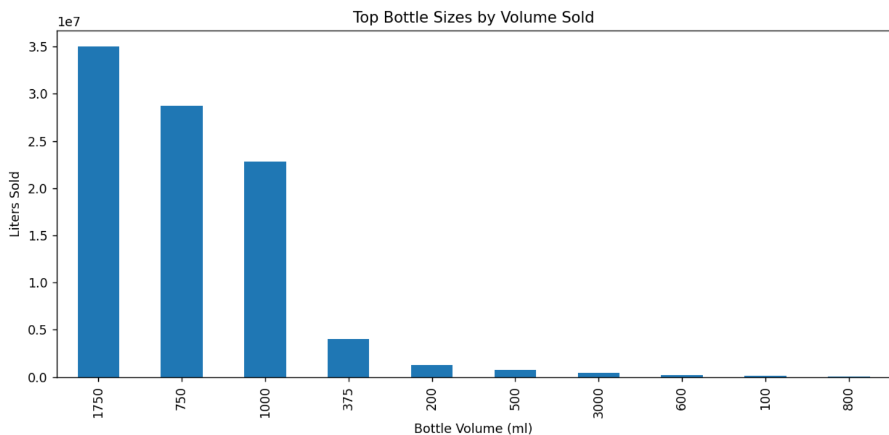
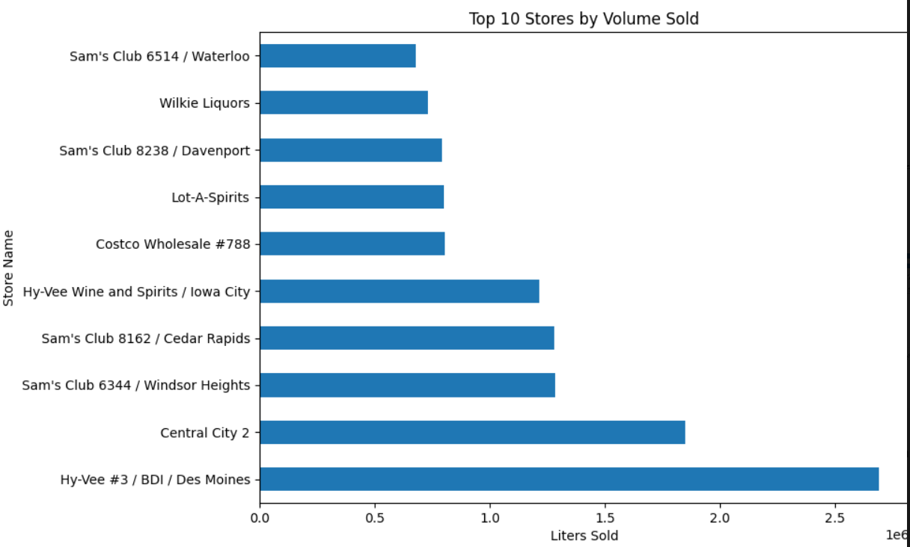
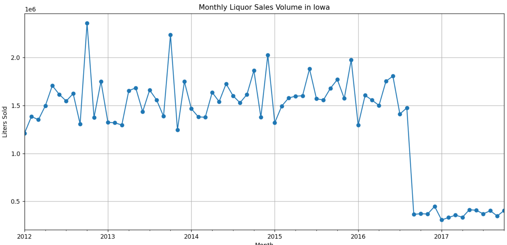
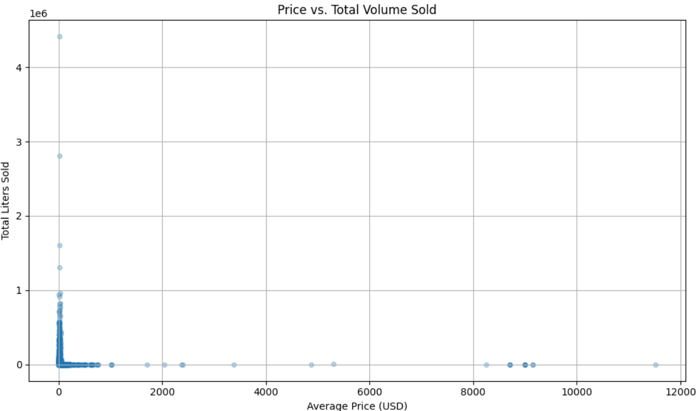
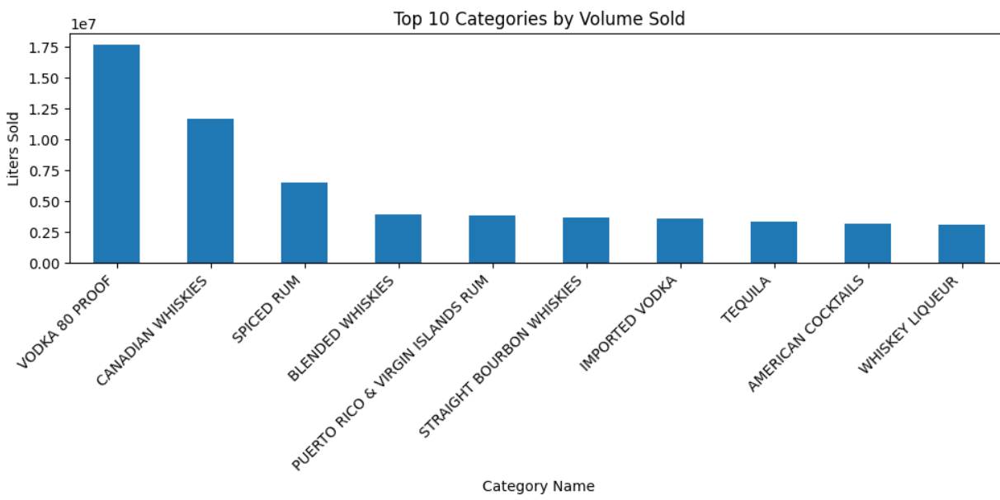

# 📊 Iowa Liquor Sales Analysis

This project analyzes liquor sales trends in Iowa from 2012 to 2017, focusing on volume, product popularity, pricing, and store performance.

---

## 📈 Monthly Sales Trend

Shows total liters of liquor sold in Iowa each month.

---

## 🍾 Top Bottle Sizes by Volume Sold

Displays the most popular bottle sizes.

---

## 🏪 Top 10 Stores by Volume Sold

Highlights the highest-selling liquor stores in Iowa.

---

## 🧪 Price vs. Volume Scatter Plot

Examines the relationship between liquor price and sales volume.

---

## 🥃 Top 10 Categories by Volume

Ranks the liquor types (vodka, whiskey, rum, etc.) by volume sold.

---

